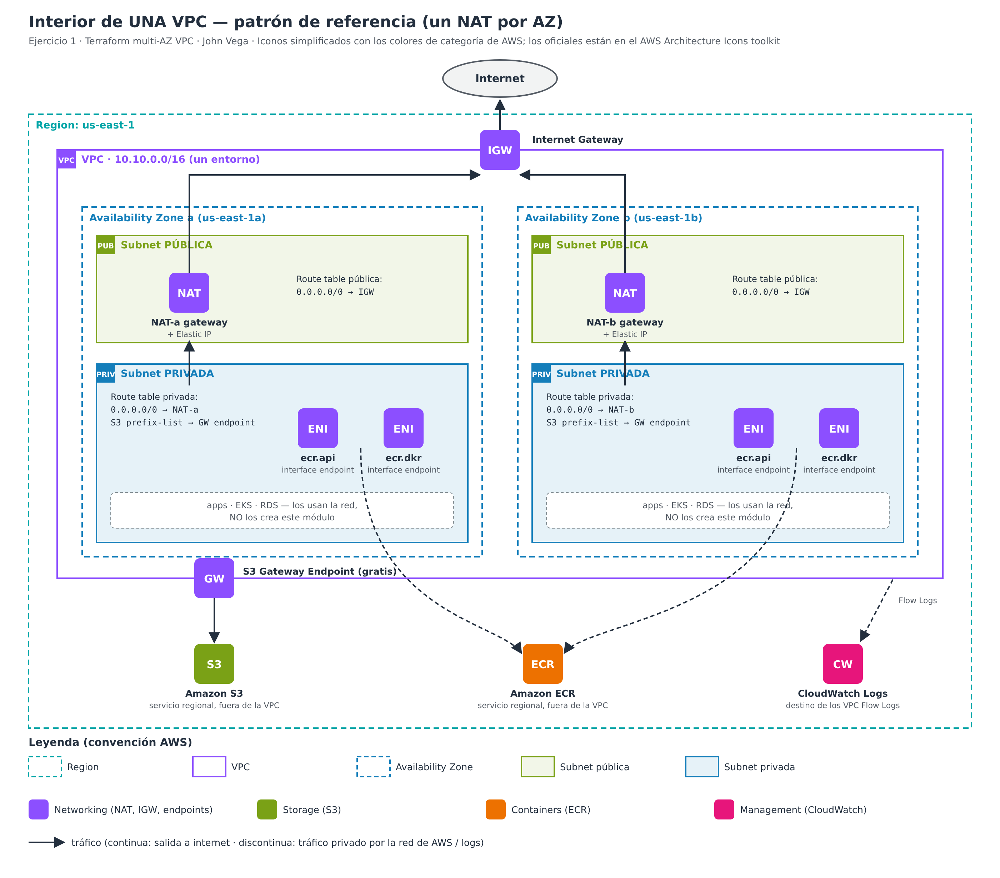

# terraform-aws-vpc-multiaz

Reusable Terraform module that provisions a **multi-AZ AWS VPC** with public and
private subnets, NAT gateways and VPC endpoints for S3 and ECR, parameterized per
region and environment (dev / stage / prod).

> Status: 🚧 work in progress — built step by step as part of a Cloud & DevOps lab.

## Problem it solves

Teams that hand-build their own networks end up with overlapping IP ranges,
databases accidentally placed in public subnets, and NAT bills nobody can explain
(for example, container image pulls from ECR going through the NAT and billed per GB).
This module gives one versioned, reviewed network definition that is instantiated
identically in every environment, changing only its inputs.

## Architecture



- **One VPC per environment** (ideally one AWS account per environment), with
  non-overlapping CIDRs so they can be connected later (Transit Gateway / peering).
- **Public subnets**: only internet-facing components (load balancers, NAT gateways).
- **Private subnets**: workloads (apps, EKS, RDS). Outbound internet via the NAT
  in the same AZ; no inbound access from the internet.
- **S3 gateway endpoint** (free) and **ECR interface endpoints** (`ecr.api`,
  `ecr.dkr`): traffic to S3/ECR stays on the AWS network instead of the NAT.

| Environment | CIDR | AZs | NAT gateways |
|---|---|---|---|
| dev   | 10.10.0.0/16 | 2 | 1 (shared, lower cost) |
| stage | 10.20.0.0/16 | 2 | 1 (shared) |
| prod  | 10.30.0.0/16 | 3 | 1 per AZ (no cross-AZ dependency) |

## Repository layout

```
modules/vpc/   reusable module (the "template")
envs/dev/      root config: calls the module with dev values
envs/stage/    root config: calls the module with stage values
envs/prod/     root config: calls the module with prod values
docs/          diagrams and design notes
```

## Requirements

| Tool | Version |
|---|---|
| Terraform | >= 1.7 |
| AWS provider | >= 5.0, < 7.0 |

## Author

John Vega
